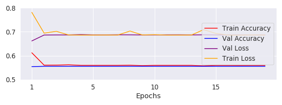
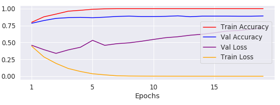

# Peter Lik vs the Average Joe

## Motivation
Photography is mainstream. Everyone is capable of taking a great photo, but what determines the photo’s quality? In such a competitive industry, I’m interested in what sets one apart from many. Peter Lik holds the record for the most expensive photo ever sold, but is his keen eye really worth $6 million for one photo? This analysis aims to identify characteristics or distinguishing features of his photos to set a world-class photographer apart from any average Joe.

If you'd like to test your own eye against actual images used in this project, click [here](https://docs.google.com/presentation/d/e/2PACX-1vQRa3yU3a-rxAVjztKp-_DUYX-UF70Mc4JAnaMruqAgB5jezbAeb9r1YTHV-CssPz5ll4jCO-P60ZDy/pub?start=true&loop=true&delayms=1000).

## Goal
Build a convolutional neural net to classify images as either a Peter Lik photograph or not. Instead of using AWS or other cloud services, use limited hardware(Ryzen 7 CPU and a Radeon RX 580 GPU) to achieve reasonable classification accuracy.

## Images
To obtain the Peter Lik(PL) images, lik.com was scraped using the python Requests, and BeautifulSoup libraries. A total of 728 images of varying resolutions were acquired. Considering the input shape of all data must be the same for a CNN, the most frequent resolution for the images was chosen(600x1800). 314 images were naturally that size, while there were 128 images which were 1800x1800, so these images were split horizontally to increase sample size. This procedure destroyed the original framing of the images(which is arguably one of the key features of Peter Lik photographs), but the same was done for non-Peter Lik photos to account for the offset. The PL images were then mirrored and flipped to increase the sample size to 2142.
The other class(non-PL) of image was obtained from a landscape image [Kaggle-Dataset](https://www.kaggle.com/arnaud58/landscape-pictures) containing over 7000 images. After filtering out all images with low resolutions, 1300 images remained. These images were then dynamically cropped to have the same(800x1600) resolution, then each image was inspected to ensure there were no watermarks, borders, or any otherwise unexpected features. Non-PL images were then mirrored to double the sample size, resultuing in 2688 images. 100 PL images and 100 non-PL images were withheld for final validation.

### Peter Lik Examples:

### Non-Peter Lik Examples:

## Baseline CNN
My initial approach used the full resolustion images. With a very basic, 4 layer CNN. Due to the size of the images, I had many issues with loading the data into memory. Loading the images in batches of 6 enabled the model to be trained, but with over 50 million parameters with the basic 4 layer model, the depth and complexity of the model was extremely limited. Reducing the images to half of their initial size allowed a slightly more complex model to run, but it didn't have the needed depth to learn from the images, and accuracy stagnated at less than 60%(which is near to the unbalance of the classes). After 2 days of adjusting image sizes and model complexity with very little improvement, I concluded that a from-scratch model could not feasibly achive good results on my local machine. 

## Transfer Learning
Transfer learning uses a pretrained model which is not trainable, allowing a much deeper, complex model to identify features of the images. The selected model was the Resnet 50 V2, which has 50 layers which were trained on millions of photos belonging to over 1000 different classes. The input size of the images for this model is 224x224, so my images were resized prior to modeling. Adding 2 Dense layers and a final sigmoid-activated output later, the resnet model with the smaller image size resulted in only 270k trainable paramters. Test accuracy capped at 93.2% accuracy after only 6 epochs with a loss of 0.24. Using these weights, perdictions on the 200 holdout images were 94% correct.

## GPU Computing
Rather than tackle the dataset(very large images) through AWS, I wanted to find an at-home solution. I currently own a pc with a Ryzen 7 CPU and a Radeon RX 580 GPU, and decided to see how feasible a CNN is with limited hardware. In order to allow tensorflow to make use of the GPU, the [Rocm](https://rocm.github.io/) docker image was implemented and [TensorFlow-GPU](https://www.tensorflow.org/install/gpu) was installed. 

